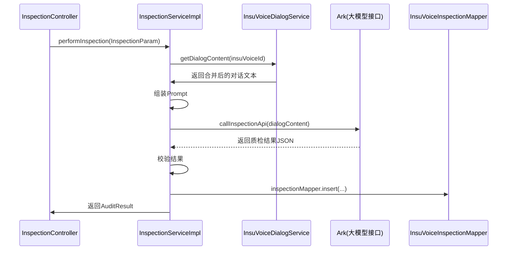

# 后端流程详解

后端主要由以下几大部分组成：

1. InspectionController  
2. InspectionService 及其实现类 InspectionServiceImpl  
3. InsuVoiceInspection（质检记录存储）  
4. InsuVoiceDialogService（对话内容获取）  
5. 规则与提示语管理（InspectionRuleService、InspectionApiConfig, InspectionPromptConfig 等）  
6. Ark客户端，用于与外部API（大模型）交互  

## 1. 质检服务的调用时序

## 2. 核心类和方法说明

### 2.1 InspectionController
文件路径:  
snowy-plugin/snowy-plugin-inspection/src/main/java/vip/xiaonuo/inspection/modular/inspection/controller/InspectionController.java

- <strong>submitInspection(@RequestBody InspectionParam)</strong>  
  路由: POST /inspection/quality/submit  
  主要逻辑：  
  1. 读取 insuVoiceId  
  2. 调用 inspectionService.performInspection(...)  
  3. 返回 AuditResult  

- <strong>getInspectionResult(@RequestParam Integer insuVoiceId)</strong>  
  路由: GET /inspection/quality/result  
  主要逻辑：  
  1. 查询 INSU_VOICE_INSPECTION 表中符合 insuVoiceId 的最新记录  
  2. 若无记录则返回“未找到质检结果”  
  3. 否则返回 inspection.getInspectionResult() JSON文本  

### 2.2 InspectionServiceImpl
文件路径:  
snowy-plugin/snowy-plugin-inspection/src/main/java/vip/xiaonuo/inspection/modular/inspection/service/impl/InspectionServiceImpl.java

- <strong>performInspection(InspectionParam)</strong>  
  1. 调用 getDialogContent(...) 获取对话内容  
  2. 调用 callInspectionApi(...) 获取质检结果  
  3. validateInspectionResult(...) 验证结果完整性  
  4. saveInspectionResult(...) 将结果存储到数据库  
  5. 返回最终的 AuditResult 对象

- <strong>getDialogContent(Integer insuVoiceId)</strong>  
  1. 使用 dialogService.list(...) 按照 START_TIME 升序查询对话列表  
  2. 调用 InspectionUtil.formatDialogContent(...) 将多个对话合并成类似 “[dialogId] role: content|[dialogId] role: content|...” 的字符串

- <strong>callInspectionApi(String dialogContent)</strong>  
  1. 构建完整 Prompt：系统提示语 + 规则提示语 + JSON模板  
  2. 通过 Ark client 的 chat.completions.create(...) 调用大模型  
  3. 解析返回结果为 AuditResult  
  4. validateInspectionResult(...) 再校验一次  

- <strong>saveInspectionResult(Integer insuVoiceId, String result)</strong>  
  1. 插入一条数据到 INSU_VOICE_INSPECTION 表  
  2. 更新 INSU_VOICE_RECORD 表的 isInspected = 1 & inspectionTime  

### 2.3 InspectionUtil
文件路径:  
snowy-plugin/snowy-plugin-inspection/src/main/java/vip/xiaonuo/inspection/modular/inspection/util/InspectionUtil.java

核心工具方法：  
- <strong>formatDialogContent(List<InsuVoiceDialog>)</strong>  
  将对话列表合并为字符串。  
- <strong>parseApiResponse(String response)</strong>  
  将JSON字符串反序列化为 AuditResult。  
- <strong>validateInspectionResult(AuditResult)</strong>  
  校验质检结果的基本合法性，如维度和角色信息等。
