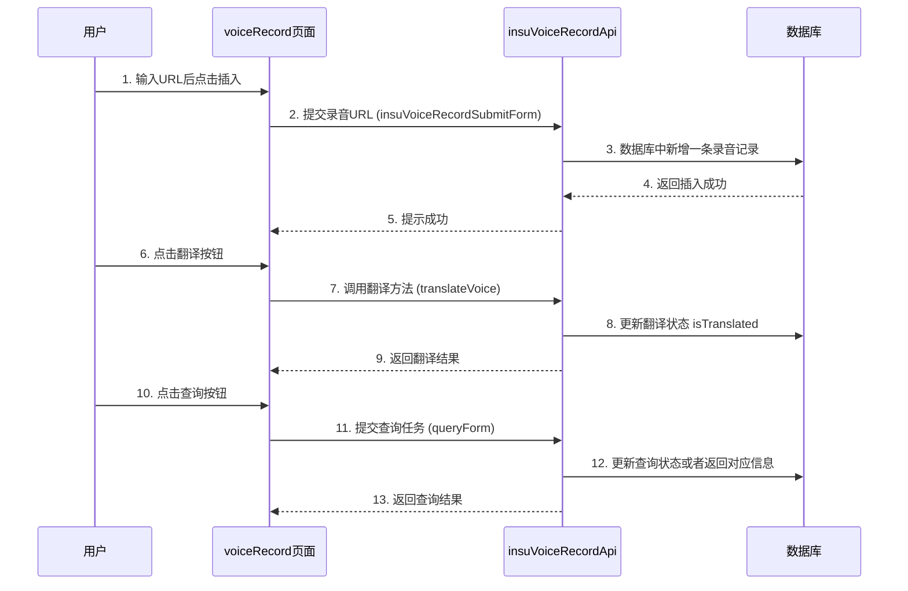
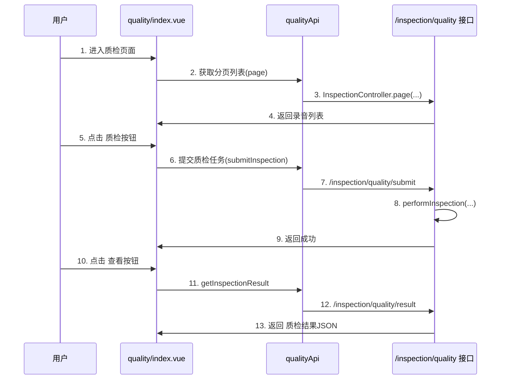

# 前端流程详解

本质检系统在前端主要有两个视图页面用于管理：  
1. 录音记录管理（voiceRecord/index.vue）  
2. 质检列表与质检结果展示（quality/index.vue）

## 1. 录音记录管理（voiceRecord/index.vue）流程

文件位置:  
snowy-admin-web/src/views/inspection/voiceRecord/index.vue

该页面核心功能包括：  
- 插入新的录音URL  
- 翻译操作  
- 查询操作  
- 显示录音列表、翻译状态、质检状态等  

下图展示了页面的主要交互流程：

### 1.1 核心函数说明  
- <strong>onSubmit()</strong>:  
  发起插入录音URL的请求；验证表单后调用 insuVoiceRecordApi.insuVoiceRecordSubmitForm(...) 提交到后端。  
  成功后刷新表格。

- <strong>handleTranslate(record)</strong>:  
  先将当前记录的 isTranslated 置为1，之后调用 translateApi.translateVoice(...)。  
  接口调用成功后，会自动刷新表格数据。  

### 1.2 参数与数据结构  
- <strong>tableRef</strong>: s-table 的引用，用于触发刷新或获取分页数据。  
- <strong>formData</strong>: 用于插入新的录音URL（voiceUrl）。  
- <strong>selectedRowKeys</strong>: 选中项的主键集合，用于批量删除等操作。

## 2. 质检列表与结果展示（quality/index.vue）流程

文件位置:  
snowy-admin-web/src/views/inspection/quality/index.vue  

主要功能：  
- 显示已上传录音的列表（是否质检）  
- 触发“质检”按钮执行质检  
- 查看已完成的质检结果

### 2.1 核心调用流程

### 2.2 关键Vue函数说明  
- <strong>handleInspect(record)</strong>:  
  前端将当前要质检的 record 传给后端 /inspection/quality/submit。  
  后端处理完成后刷新列表，再自动调用 handleView(...) 查看质检结果。  
- <strong>handleView(record)</strong>:  
  请求后端 /inspection/quality/result 接口，返回审计结果 JSON 并展示在右侧面板。