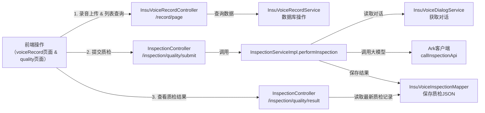

# 整体架构说明

本质上，本质检系统由以下主要部分构成：

1. 前端（Vue）  
   - 负责展示质检列表、录音信息、以及发起质检操作、查看质检结果等交互。
   - 主要界面文件在 snowy-admin-web/src/views/inspection/quality/index.vue 以及 snowy-admin-web/src/views/inspection/voiceRecord/index.vue 等。

2. 后端（Spring Boot + MyBatis）  
   - 主要功能包括：  
     a) 录音记录管理（InsuVoiceRecord）  
     b) 对话内容管理（InsuVoiceDialog）  
     c) 质检任务执行（ InspectionService、InspectionServiceImpl 等）  
     d) 质检结果存储并展现（InsuVoiceInspection）  
     e) 与外部接口（大模型或LLM）的调用（Ark 客户端调用）  

3. 数据库  
   - 主要有以下表：  
     - INSU_VOICE_RECORD：录音记录  
     - INSU_VOICE_DIALOG：对话记录  
     - INSU_VOICE_INSPECTION：质检结果表  
     - INSU_VOICE_QUERY_RESULT：查询结果表
     - INSU_INSPECTION_RULE：质检规则表

下图是整体的数据流与服务间调用的简要示意图：

- 步骤说明：  
  1. 前端的 voiceRecord 页面发起录音URL插入/翻译/查询等请求，或者通过 quality 页面进行直接的质检操作。  
  2. 后端根据请求类型，查询数据库表或调用第三方服务(如LLM API)完成质检逻辑。  
  3. 质检结果保存到 INSU_VOICE_INSPECTION 表后，再由前端获取并展示在界面上。